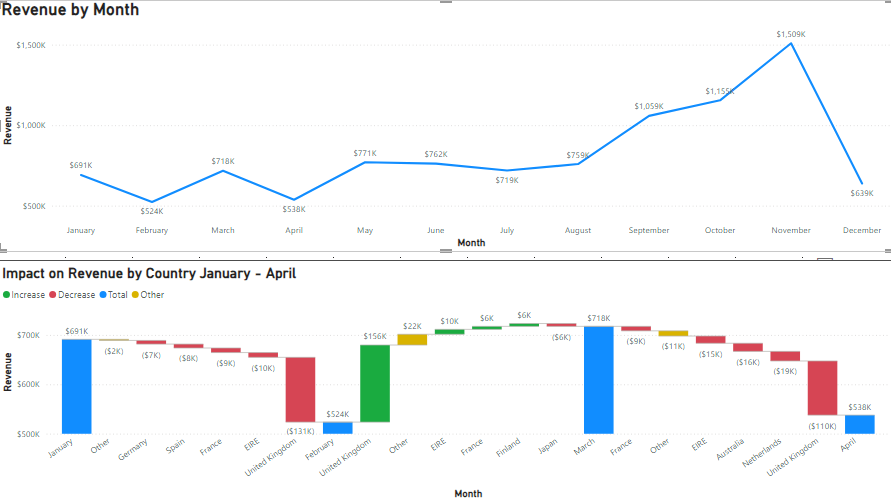

# Online Retail Store

### About the Case Study

This case study was part of an online job simulation certificate [***Data Visualisation: Empowering Business with Effective Insights***](https://www.theforage.com/simulations/tata/data-visualisation-p5xo) offered by **Tata Group**. 

### About the dataset

This is a transnational data set which contains all the transactions occurring between 01/12/2010 and 09/12/2011 for a UK-based and registered non-store online retail.The company mainly sells unique all-occasion gifts. Many customers of the company are wholesalers.

The dataset contains more than 5,41,000 rows.
 
### Data Source

The dataset was available on the online portal for the course. It is publically available on ***[UC Irvine Machine Learning Repository](https://archive.ics.uci.edu/)*** The data can be found [here](https://archive.ics.uci.edu/dataset/352/online+retail)

### Acknowledgements

The dataset has been made available by **Daqing Chen, Sai Laing Sain, Kun Guo** for
[Data mining for the online retail industry: A case study of RFM model-based customer segmentation using data mining. 2012](https://www.semanticscholar.org/paper/Data-mining-for-the-online-retail-industry%3A-A-case-Chen-Sain/e43a5a90fa33d419df42e485099f8f08badf2149)

Published in Journal of Database Marketing and Customer Strategy Management, Vol. 19, No. 3

### Data Cleaning

First of all uesed conditional formatting to indentify blank/missing values. 

Found 1,35,079 rows with missing Customer Ids and 1453+47 = 1500 rows with missing or invalid description just with a "?"
- Used **Find & Replace** feature to replace these blank/invalid values with "Unknown" 

As per the instructions filtered and removed rows with Quantity<1 and UnitPrice<0, as these should not be included in the analysis
- There were 10624 rows with Qunatity less than 1, and 2 rows with UnitPrice less than 0
* Removed all these rows. To delete these rows first filtered the table for Quantity<1 and UnitPrice<0 then deleted the filtered rows from the table.

### Analysis and Visualization

### Skills Used in Excel
- Formating
- Text to Columns
- Conditional Formating
- Data Cleaning
- Sorting and Filtering
- Power Query
  - Splitting Columns
  - Removing unwanted space (Trim)
  - Changing Data Type
  - Replacing missing values with appropriate values
  - Transformation -> Change Case to Proper, UPPER
- Data Visualization - Charts and Graphs
  - Column Chart
  - Bar Chart
  - Line Chart
  - Waterfall Chart
  - Map
  - Table
- Formulas (COUNTBLANK, UNIQUE, TEXT)

### Dashboard Images

