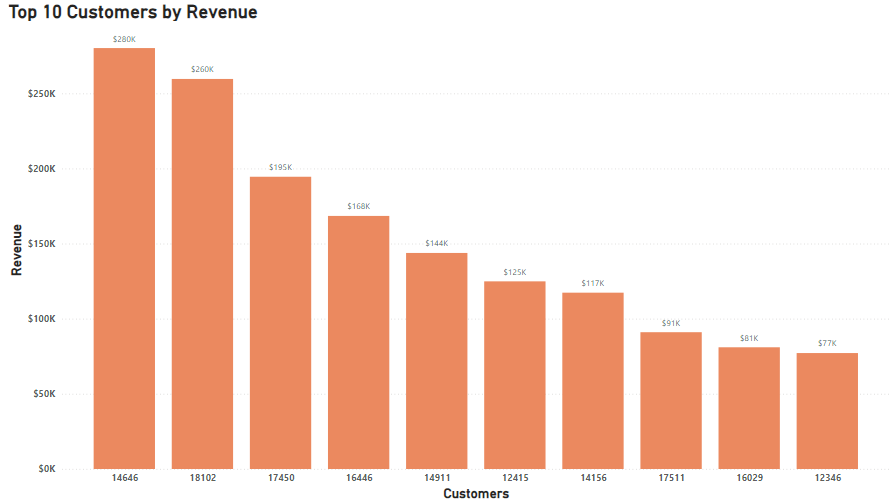

# Online Retail Store Data Analysis using & POWER BI

### About the Case Study

This case study was part of an online job simulation certificate [***Data Visualisation: Empowering Business with Effective Insights***](https://www.theforage.com/simulations/tata/data-visualisation-p5xo) offered by **Tata Group**. 

### About the dataset

This is a transnational data set which contains all the transactions occurring between 01/12/2010 and 09/12/2011 for a UK-based and registered non-store online retail.The company mainly sells unique all-occasion gifts. Many customers of the company are wholesalers.

The dataset contains more than 5,41,000 rows.
 
### Data Source

The dataset was available on the online portal for the course. It is publically available on ***[UC Irvine Machine Learning Repository](https://archive.ics.uci.edu/)*** The data can be found [here](https://archive.ics.uci.edu/dataset/352/online+retail)

### Acknowledgements

The dataset has been made available by **Daqing Chen, Sai Laing Sain, Kun Guo** for
[Data mining for the online retail industry: A case study of RFM model-based customer segmentation using data mining. 2012](https://www.semanticscholar.org/paper/Data-mining-for-the-online-retail-industry%3A-A-case-Chen-Sain/e43a5a90fa33d419df42e485099f8f08badf2149)

Published in Journal of Database Marketing and Customer Strategy Management, Vol. 19, No. 3

### Data Cleaning
- Downloaded the data from the source and kept a copy of the data, before cleaning.
- Used **Conditional formatting** in Excel to indentify blank/missing values. 
  * Found 1,35,079 rows with missing Customer Ids and 1453+47 = 1500 rows with missing or invalid description just with a "?"

- Used **Find & Replace** feature to replace these blank/invalid values with "Unknown" 

- As per the instructions rows with Quantity<1 and UnitPrice<0 should not be included in the analysis
  * Used **CountIFs** function to count such rows. Found, there were 10624 rows with Qunatity less than 1, and 2 rows with UnitPrice less than 0
  * Removed all these rows. To delete these rows first filtered the table for Quantity<1 and UnitPrice<0 then deleted the filtered rows from the table.
- Used **Text to Columns** to remove any inconsistencies in the InvoiceDate column.
- Changed format of all columns to appropriate format.

### Analysis and Visualization
- Created a **line chart** to visualize revenue from Jan-11 to Dec-11
  * The chart reveals a mix trend in revenue from Jan to Apr then it shows a small growth from May till Nov.
- The above line chart revealed a sharp dip in revenue between Jan to Apr. To investigate the reason behind this dip, created a **waterfall chart**
  * The waterfall chart shows that UK contributed the most to decrease the revenue in Feb as well as Apr.
- The **bar chart** for Top 10 Country by Revenue (excluding UK) shows that Netherlands, EIRE and Germany are the leading countries followed by Australia, Spain. The chart also shows a huge gap in revenue between the first country in the list and the tenth country. This suggests the posibility of doing something to improve in this direction.
- Created a **column chart** to visualize top 10 customers. First two customers are particularly noteworthy for their substantial contributions they contributed more than $250K each. We can see considerable gap in the revenue between the top-performing customers and the rest, indicating potential areas for our customer satisfaction strategies.
- Created a **Map chart** to show the distribution of sales of the company excluding UK.
- The Map clearly highlights a concentration of demand in European countries, with larger bubbles indicating stronger demand in regions like Germany and France. While Europe takes the spotlight, there is potential in regions like Australia and parts of Asia, as indicated by the presence of bubbles, though smaller in size.

### Skills Used in Excel
- Formating
- Text to Columns
- Conditional Formating
- Data Cleaning
- Sorting and Filtering
- Power Query
- Data Visualization in **Power BI** - Charts and Graphs
  - Column Chart
  - Bar Chart
  - Line Chart
  - Waterfall Chart
  - Map
  - Table
- Formulas (COUNTBLANK, COUNTIFS, UNIQUE)

### Dashboard Images

